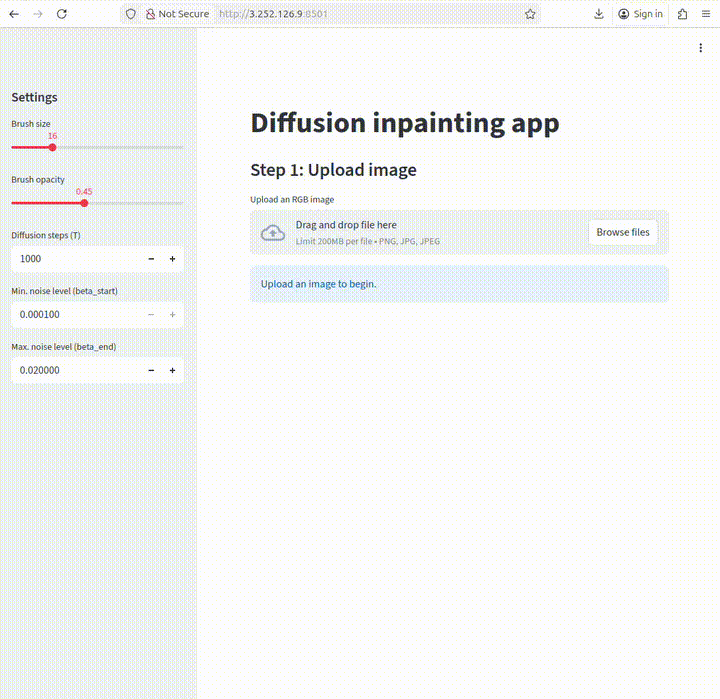
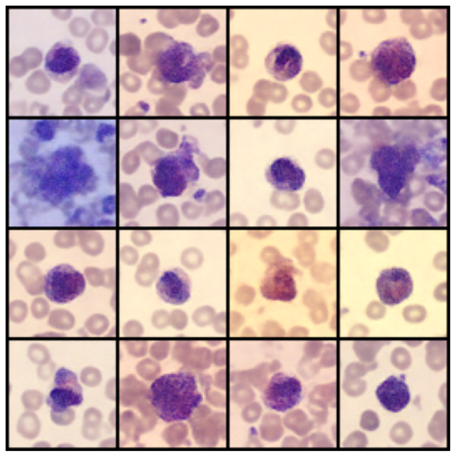

# Introduction

<figure>
<p align="center">
  
</p>
  <figcaption align="center"><b>Figure.</b> Interactive diffusion-based inpainting results on an H&E image of a monocyte, illustrating reconstruction of masked regions while preserving the observed context.</figcaption>
</figure>
</br></br>

-----------------------------

The aim of this project is to explore the ability of diffusion models to generate missing regions in images. It restores corrupted areas in H&E cell images using a compact diffusion model and a simple Streamlit UI. 

Recognizing blood cell types in microscopic images is central to clinical diagnostics. While the task has been studied for decades, recent machine learning and deep learning methods continue to improve accuracy ([Acevedo et al., 2019](https://www.sciencedirect.com/science/article/abs/pii/S0169260719303578?via%3Dihub); [Deltadahl et al., 2025](https://www.nature.com/articles/s42256-025-01122-7)). Rather than classifying immune cells, this project applies diffusion-based inpainting—with a linear noise schedule and standard ε-prediction—to restore user-marked regions of H&E images. The training data comprises 17,092 expert-annotated single-cell H&E images (JPG, 360×363 px) captured with the CellaVision DM96 and published by [Acevedo et al., 2019](https://www.sciencedirect.com/science/article/abs/pii/S0169260719303578?via%3Dihub) (URL: https://data.mendeley.com/datasets/snkd93bnjr/1). Classes include neutrophils, eosinophils, basophils, lymphocytes, monocytes, immature granulocytes, erythroblasts, and platelets. H&E staining combines hematoxylin (nuclei, purplish blue) and eosin (cytoplasm/extracellular matrix, pink).


If you're interested in other diffusion-based generative methods on H&E images, check out a model called [CytoDiffusion](https://www.nature.com/articles/s42256-025-01122-7) by Deltadahl et al, Nature Machine Intelligence 2025. It's is a newly published diffusion-based model designed specifically for blood cell morphology analysis. Instead of being a traditional classifier that only learns boundaries between labeled categories, it models the full distribution of blood cell appearances using generative diffusion techniques.

# Tech Stack

### Machine Learning | Data Science

🧪 Diffusion model • UNet • linear noise schedule  
🧠 NumPy • Pandas • scikit-learn  
🔥 PyTorch  
📊 Matplotlib • Seaborn  


### MLOps & Deployment

🎨 Streamlit  
🐳 Docker  
☁️ AWS EC2 (single GPU instance)

# Methods

## Features

- Interactive inpainting in the browser (Streamlit)
- Paint masks to define regions to restore
- Checkpointed UNet-based DDPM (64×64) for fast sampling
- Composite the model’s prediction back onto the original image size
- Run locally, via Docker or in the cloud via AWS EC2


## Project Structure

### Phase 1 - Diffusion 101

Here, labels of the cell types are ignored and the model is trained in an unconditional setting.

- Images are resized to 64 × 64 pixels.
- A small DDPM is trained on single-cell images.
- The goal is to generate plausible single-cell images without any conditioning.

This phase is designed to introduce and solidify the core concepts of diffusion models, including:

- The forward and reverse diffusion processes  
- Noise schedules  
- U-Net conditioning on the diffusion timestep

Results analysis can be found in `notebooks/01_unconditional_diffusion.ipynb`.

<figure>
<p align="center">
  
</p>
  <figcaption align="center"><b>Figure.</b> Unconditional samples generated by the diffusion model after training on single-cell H&E images.</figcaption>
</figure>
</br></br>

---

### Phase 2 - Inpainting Diffusion

This phase demonstrates the model's ability to reason about missing visual information and to generate plausible cell morphology under partial observation (image inpainting).

- Input images are corrupted using a binary mask.
- The model input is constructed by concatenating:
  - the masked image, and
  - the corresponding mask.
- The model is trained using standard ε-prediction.
- During sampling, known pixels are clamped to enforce consistency with the observed image.

Results analysis can be found in `notebooks/02_Inpainting_Diffusion.ipynb`.

<figure>
<p align="center">
  
</p>
  <figcaption align="center"><b>Figure.</b> Diffusion-based inpainting results. The model reconstructs masked regions while preserving the observed context.</figcaption>
</figure>
</br></br>

---

### Future extensions

Possible extensions include:

- Conditioning the diffusion model on cell-type labels using learned embeddings
- Generating samples under partial observation, e.g.  
  *"Generate an erythroblast image with the nucleus region masked."*
- Evaluating how class conditioning influences structural and morphological fidelity

----

# Deployment

Demo inference: upload an image + mask -> run inpainting sampling -> show result

My steps:

- a Streamlit UI that accepts inputs, preprocesses them exactly like training, and
- an inference function that loads the trained inpainting DDPM and runs clamped sampling with the mask


#### Locally

Run locally:
- Pipenv
```bash
  pipenv install
  pipenv run streamlit run app/app.py
```
- via Docker (build and run from the project root)
```bash
docker build -t diffusion-inpaint .
docker run --rm -p 8501:8501 diffusion-inpaint
# Open http://localhost:8501 in your browser
```


### AWS EC2 

This runs the Streamlit app on a single GPU instance and serves it directly to users.

1) Launch an EC2 GPU instance (g4dn.xlarge or g5.xlarge) with Ubuntu 22.04.
2) Open inbound port 8501 in the security group:
```text
Go to the AWS EC2 Console → Security Groups.
Select sg-0428c711c1b2dcde8 (launch-wizard-2).
Go to the “Inbound rules” tab and click “Edit inbound rules”.
Click "Add rule":
Type: Custom TCP
Port range: 8501
Source: 0.0.0.0/0 (or your IP for restricted access)
```
3) SSH into the instance and run:

```bash
sudo apt update && sudo apt install -y git python3-pip python3-venv
git clone https://github.com/katwre/Diffusion-models-for-cell-images-api.git
cd Diffusion-models-for-cell-images-api

# Create and activate a virtual environment
python3 -m venv venv
source venv/bin/activate
# Upgrade pip and install dependencies inside the venv
pip3 install -U pip
pip3 install streamlit streamlit-drawable-canvas-fix numpy pillow torch torchvision

# Download trained models
wget -O checkpoints.tar.gz "https://www.dropbox.com/scl/fi/1gm0ux4r0zq8b1qpe1b7c/checkpoints.tar.gz?rlkey=uh8kskedcwarztw0r6yn2yv8d&st=i58up58q&dl=1"
tar -xzvf checkpoints.tar.gz

# Run the app
streamlit run app/app.py --server.port 8501 --server.address 0.0.0.0
```

Open the app at:
```text
http://<EC2_PUBLIC_IP>:8501
```
For example:
```text
http://3.252.126.9:8501
```

Cost control: stop or terminate the instance when not in use.
