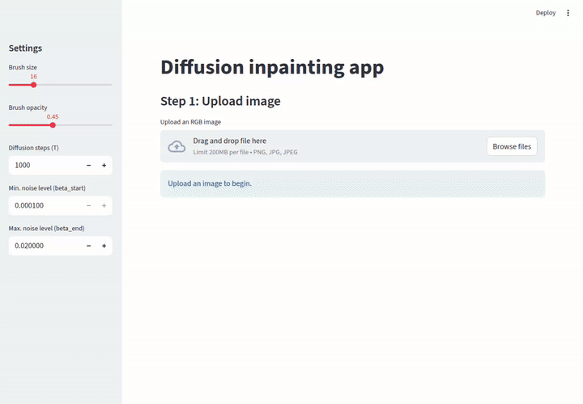

# Introduction

<figure>
<p align="center">
  
</p>
  <figcaption align="center"><b>Figure.</b> Interactive diffusion-based inpainting results on an H&E image of a monocyte, illustrating reconstruction of masked regions while preserving the observed context.</figcaption>
</figure>
</br></br>

-----------------------------

The aim of this project is to explore the ability of diffusion models to generate missing regions in images. It restores corrupted areas in H&E cell images using a compact diffusion model and a simple Streamlit UI. 

Recognizing blood cell types in microscopic images is central to clinical diagnostics. While the task has been studied for decades, recent machine learning and deep learning methods continue to improve accuracy ([Acevedo et al., 2019](https://www.sciencedirect.com/science/article/abs/pii/S0169260719303578?via%3Dihub); [Deltadahl et al., 2025](https://www.nature.com/articles/s42256-025-01122-7)). Rather than classifying immune cells, this project applies diffusion-based inpainting—with a linear noise schedule and standard ε-prediction—to restore user-marked regions of H&E images. The training data comprises 17,092 expert-annotated single-cell H&E images (JPG, 360×363 px) captured with the CellaVision DM96 and published by [Acevedo et al., 2019](https://www.sciencedirect.com/science/article/abs/pii/S0169260719303578?via%3Dihub) (URL: https://data.mendeley.com/datasets/snkd93bnjr/1). Classes include neutrophils, eosinophils, basophils, lymphocytes, monocytes, immature granulocytes, erythroblasts, and platelets. H&E staining combines hematoxylin (nuclei, purplish blue) and eosin (cytoplasm/extracellular matrix, pink).


If you're interested in other diffusion-based generative methods on H&E images, check out a model called [CytoDiffusion](https://www.nature.com/articles/s42256-025-01122-7) by Deltadahl et al, Nature Machine Intelligence 2025. It's is a newly published diffusion-based model designed specifically for blood cell morphology analysis. Instead of being a traditional classifier that only learns boundaries between labeled categories, it models the full distribution of blood cell appearances using generative diffusion techniques.

# Tech Stack

### Machine Learning | Data Science

🧪 Diffusion model • UNet • linear noise schedule  
🧠 NumPy • Pandas • scikit-learn  
🔥 PyTorch  
📊 Matplotlib • Seaborn  


### MLOps & Deployment

🎨 Streamlit  
🐳 Docker  
☁️ AWS Batch (on-demand GPU jobs for diffusion model sampling/inference)  
📦 AWS ECR


# Methods

## Features

- Interactive inpainting in the browser (Streamlit)
- Paint masks to define regions to restore
- Checkpointed UNet-based DDPM (64×64) for fast sampling
- Composite the model’s prediction back onto the original image size
- Run locally, via Docker or in the cloud via AWS EC2


## Project Structure

### Phase 1 - Diffusion 101

Here, labels of the cell types are ignored and the model is trained in an unconditional setting.

- Images are resized to 64 × 64 pixels.
- A small DDPM is trained on single-cell images.
- The goal is to generate plausible single-cell images without any conditioning.

This phase is designed to introduce and solidify the core concepts of diffusion models, including:

- The forward and reverse diffusion processes  
- Noise schedules  
- U-Net conditioning on the diffusion timestep

Results analysis can be found in `notebooks/01_unconditional_diffusion.ipynb`.

<figure>
<p align="center">
  
</p>
  <figcaption align="center"><b>Figure.</b> Unconditional samples generated by the diffusion model after training on single-cell H&E images.</figcaption>
</figure>
</br></br>

---

### Phase 2 - Inpainting Diffusion

This phase demonstrates the model's ability to reason about missing visual information and to generate plausible cell morphology under partial observation (image inpainting).

- Input images are corrupted using a binary mask.
- The model input is constructed by concatenating:
  - the masked image, and
  - the corresponding mask.
- The model is trained using standard ε-prediction.
- During sampling, known pixels are clamped to enforce consistency with the observed image.

Results analysis can be found in `notebooks/02_Inpainting_Diffusion.ipynb`.

<figure>
<p align="center">
  
</p>
  <figcaption align="center"><b>Figure.</b> Diffusion-based inpainting results. The model reconstructs masked regions while preserving the observed context.</figcaption>
</figure>
</br></br>

---

### Future extensions

Possible extensions include:

- Conditioning the diffusion model on cell-type labels using learned embeddings
- Generating samples under partial observation, e.g.  
  *"Generate an erythroblast image with the nucleus region masked."*
- Evaluating how class conditioning influences structural and morphological fidelity

----

# Deployment

Demo inference: upload an image + mask -> run inpainting sampling -> show result

My steps:

- a Streamlit UI that accepts inputs, preprocesses them exactly like training, and
- an inference function that loads the trained inpainting DDPM and runs clamped sampling with the mask


#### Locally

Run locally:
- Pipenv
```bash
  pipenv install
  pipenv run streamlit run app/app.py
```
- via Docker (build and run from the project root)
```bash
docker build -t diffusion-inpaint .
docker run --rm -p 8501:8501 diffusion-inpaint
# Open http://localhost:8501 in your browser
```


### Run GPU sampling on AWS Batch (on demand)

Follow these steps to run the inpainting on GPUs only when needed, while keeping Streamlit on a small CPU instance.

1) Build and push the GPU image to ECR
- Build locally:
```bash
docker build -f Dockerfile.gpu -t diffusion-inpaint-gpu .
```
- Create an ECR repo (one-time):
```bash
aws ecr create-repository --repository-name diffusion-inpaint-gpu
```
- Log in and push:
```bash
aws ecr get-login-password | docker login --username AWS --password-stdin <account>.dkr.ecr.<region>.amazonaws.com
docker tag diffusion-inpaint-gpu <account>.dkr.ecr.<region>.amazonaws.com/diffusion-inpaint-gpu:latest
docker push <account>.dkr.ecr.<region>.amazonaws.com/diffusion-inpaint-gpu:latest
```

2) Create AWS Batch resources
- IAM roles (one-time):
  - Batch service role: `AWSBatchServiceRole`
  - EC2 instance role for the compute environment: allow S3 `GetObject/PutObject` for your bucket
  - (Optional) Job role: task-level S3 `Get/Put`
- Compute environment (Managed, EC2):
  - Type: EC2, On-Demand
  - Instance types: e.g., `g4dn.xlarge`
  - vCPU min: 0 (idle cost = 0), vCPU max: 4–8
  - VPC + subnets + security groups (your defaults work)
  - Instance role: the EC2 role above
- Job queue:
  - Create a queue and attach the compute environment (priority > 0)
- Job definition (container):
  - Image: ECR URI (e.g., `<account>.dkr.ecr.<region>.amazonaws.com/diffusion-inpaint-gpu:latest`)
  - vCPUs: 4, Memory: 8–16 GB
  - GPUs: 1
  - Command: `python /src/diffusion_cells/infer_batch.py`
  - Environment (defaults you can override on submit):
    - `CHECKPOINT_PATH=/checkpoints/phase2_inpaint_unet.pt`
    - `STEPS=1000`, `BETA_START=1e-4`, `BETA_END=2e-2` (optional)
  - Job role: (optional) the IAM role with S3 `Get/Put`

3) Wire Streamlit to Batch (front-end on a small CPU instance)
- Upload inputs to S3 on button click:
  - `s3.put_object(Bucket="<bucket>", Key="<key-input>", Body=input_png_bytes)`
  - `s3.put_object(Bucket="<bucket>", Key="<key-mask>", Body=mask_png_bytes)`
- Submit the Batch job:
  - `batch.submit_job(jobName="inpaint-<id>", jobQueue="<queue>", jobDefinition="<job-def>", containerOverrides={"environment": [ {"name":"INPUT_S3_URI","value":"s3://<bucket>/<key-input>"}, {"name":"MASK_S3_URI","value":"s3://<bucket>/<key-mask>"}, {"name":"OUTPUT_S3_URI","value":"s3://<bucket>/<key-output>"}, {"name":"CHECKPOINT_PATH","value":"/checkpoints/phase2_inpaint_unet.pt"} ]})`
- Poll S3 for the result:
  - Repeat `s3.head_object(Bucket, Key)` with a short sleep until it exists
  - Then `s3.get_object(...)` and display the PNG in Streamlit

4) What the Batch job does (infer_batch.py)
- Downloads `INPUT_S3_URI` (image) and `MASK_S3_URI` (white=masked region)
- Runs inpainting at 64×64, composites the prediction back onto the original resolution within the mask
- Uploads the final PNG to `OUTPUT_S3_URI`
- (Optional) writes a tiny status JSON if `STATUS_S3_URI` is provided

Tips
- Keep compute environment min vCPUs = 0 to avoid idle GPU costs; GPUs spin up only when a job is queued.
- Ensure your IAM roles grant S3 `GetObject/PutObject` on your bucket/prefix for both the Streamlit host and Batch jobs.
- If your EC2 GPU CUDA version differs, adjust `Dockerfile.gpu` to a matching CUDA tag and PyTorch wheels.
