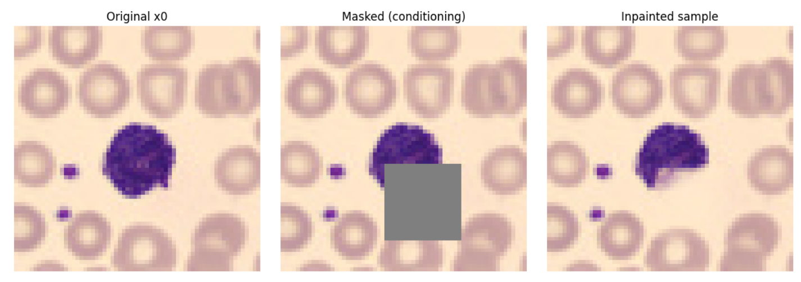

# Introduction

<figure>

  

  <figcaption align="center"><b>Figure.</b> Diffusion-based inpainting results on an H&amp;E image of a monocyte, illustrating reconstruction of masked regions while preserving the observed context.</figcaption>
</figure>
  

-----------------------------

The aim of this project is to explore the ability of diffusion models to generate missing regions in images, such as H&E-stained blood cell microscopy images.

Recognizing blood cell types in microscopic images is an important task in clinical diagnostics. Although this problem has been studied for decades, new machine learning and deep learning approaches continue to improve classification accuracy ([Acevedo et al. (2019)](https://www.sciencedirect.com/science/article/abs/pii/S0169260719303578?via%3Dihub) and [Deltadahl et al, Nature Machine Intelligence 2025](https://www.nature.com/articles/s42256-025-01122-7))

The dataset used in this project is publicly available on Mendeley Data by [Acevedo et al. (2019)](https://www.sciencedirect.com/science/article/abs/pii/S0169260719303578?via%3Dihub): https://data.mendeley.com/datasets/snkd93bnjr/1. It contains a total of 17,092 images of individual normal cells, which were acquired using a microscope called the analyzer CellaVision DM96 in the Core Laboratory at the Hospital Clinic of Barcelona (i.e. H&E stain images). H&E is the combination of two histological stains: hematoxylin and eosin. The hematoxylin stains cell nuclei a purplish blue, and eosin stains the extracellular matrix and cytoplasm pink, with other structures taking on different shades, hues, and combinations of these colors. The dataset is organized in the following eight groups: neutrophils, eosinophils, basophils, lymphocytes, monocytes, immature granulocytes (promyelocytes, myelocytes, and metamyelocytes), erythroblasts and platelets or thrombocytes. The size of the images is 360 x 363 pixels, in format JPG, and they were annotated by expert clinical pathologists. The images were captured from individuals without infection, hematologic or oncologic disease and free of any pharmacologic treatment at the moment of blood collection.

If you're interested in other diffusion-based generative methods onb H&E images, check out a model called [CytoDiffusion](https://www.nature.com/articles/s42256-025-01122-7) by Deltadahl et al, Nature Machine Intelligence 2025. It's is a newly published diffusion-based model designed specifically for blood cell morphology analysis. Instead of being a traditional classifier that only learns boundaries between labeled categories, it models the full distribution of blood cell appearances using generative diffusion techniques.

# Tech Stack

### Machine Learning | Data Science
🧠 NumPy • Pandas • scikit-learn  
🔥 PyTorch  
📊 Matplotlib • Seaborn  

<!--
### MLOps & Deployment [TBD]
🐳 Docker  
☁️ AWS EC2  
📦 AWS ECR
-->

# Methods

## Project Structure

### Phase 1 - Diffusion 101

Here, labels of the cell types are ignored and the model is trained in an unconditional setting.

- Images are resized to 64 × 64 pixels.
- A small DDPM is trained on single-cell images.
- The goal is to generate plausible single-cell images without any conditioning.

This phase is designed to introduce and solidify the core concepts of diffusion models, including:

- The forward and reverse diffusion processes  
- Noise schedules  
- U-Net conditioning on the diffusion timestep

Results analysis can be found in `notebooks/01_unconditional_diffusion.ipynb`.

<figure>

  

  <figcaption align="center"><b>Figure.</b> Unconditional samples generated by the diffusion model after training on single-cell H&E images.</figcaption>
</figure>
  

---

### Phase 2 - Inpainting Diffusion

This phase demonstrates the model's ability to reason about missing visual information and to generate plausible cell morphology under partial observation (image inpainting).

- Input images are corrupted using a binary mask.
- The model input is constructed by concatenating:
  - the masked image, and
  - the corresponding mask.
- The model is trained using standard ε-prediction.
- During sampling, known pixels are clamped to enforce consistency with the observed image.

Results analysis can be found in `notebooks/02_Inpainting_Diffusion.ipynb`.

<figure>

  

  <figcaption align="center"><b>Figure.</b> Diffusion-based inpainting results. The model reconstructs masked regions while preserving the observed context.</figcaption>
</figure>
  

---

### Future extensions

Possible extensions include:

- Conditioning the diffusion model on cell-type labels using learned embeddings
- Generating samples under partial observation, e.g.  
  *"Generate an erythroblast image with the nucleus region masked."*
- Evaluating how class conditioning influences structural and morphological fidelity

----
